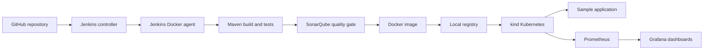

# Project 06: Local End-to-End CI/CD Pipeline

This project implements an advanced CI/CD workflow entirely on a local workstation, without paid cloud resources. Jenkins builds and tests a Java application, SonarQube enforces a quality gate, Docker packages and publishes the application, kind runs it on Kubernetes, and Prometheus/Grafana provide monitoring.

## Pipeline architecture



## Tools

- Jenkins controller and inbound build agent
- Maven and Java 8 for the legacy Spring Boot application
- Java 17 for the Jenkins agent and SonarQube scanner
- SonarQube with PostgreSQL
- Docker and a local registry at `localhost:5000`
- kind and Kubernetes
- Prometheus and Grafana through `kube-prometheus-stack`

## CI/CD stages

1. Checkout the Git repository.
2. Build and test with Maven.
3. Analyze the source with SonarQube.
4. Enforce the SonarQube quality gate.
5. Build and push versioned and `latest` Docker images.
6. Import the image into the local kind node.
7. Apply Kubernetes resources and wait for a successful rollout.
8. Report the deployed pods and service.

The Jenkins agent label is `project06-agent`. The configured Jenkins SonarQube server name is `project06-sonarqube`. Credentials are stored in Jenkins and are never committed to this repository.

The pipeline polls GitHub every two minutes. This is the practical free option for a Jenkins controller running only on `localhost`; a public GitHub webhook cannot reach a private localhost address without a tunnel.

## Application deployment

The safe local manifests are:

- `namespace.yaml`
- `deployment.local.yaml`
- `service.local.yaml`

Apply them manually when needed:

```powershell
kubectl apply -f .\namespace.yaml
kubectl apply -f .\deployment.local.yaml
kubectl apply -f .\service.local.yaml
kubectl rollout status deployment/sample-app -n sample-app
```

Forward the application locally:

```powershell
kubectl port-forward -n sample-app service/sample-app-service 8002:8000
```

Then open <http://localhost:8002/>.

## Monitoring

Prometheus and Grafana run in the `monitoring` namespace. Useful local forwards are:

```powershell
kubectl port-forward -n monitoring service/monitoring-kube-prometheus-prometheus 9090:9090
kubectl port-forward -n monitoring service/monitoring-grafana 3001:80
```

Example PromQL for receive bandwidth:

```promql
sum by (pod) (
  rate(container_network_receive_bytes_total{
    namespace="sample-app",
    pod=~"sample-app-.*"
  }[1m])
)
```

For transmit bandwidth, replace `receive` with `transmit`.

## Security notes

- Do not commit Jenkins agent secrets, SonarQube tokens, API credentials, or `.env` files.
- The demo endpoint has no external API credentials or embedded secrets.
- Rotate any credential that has been copied into a terminal transcript, screenshot, or chat.

## Local-to-cloud mapping

| Local component | Cloud equivalent |
|---|---|
| kind | Amazon EKS or another managed Kubernetes service |
| Local Docker registry | JFrog Artifactory or Amazon ECR |
| Docker containers | Virtual machines or managed container services |
| Local persistent volumes | Managed block/database storage |

This design demonstrates the same delivery stages locally while avoiding cloud charges.

## Pipeline verification

The complete local CI/CD pipeline was successfully validated with Jenkins, SonarQube, Docker, Kubernetes, Prometheus, and Grafana.
